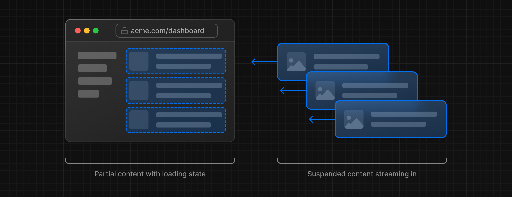
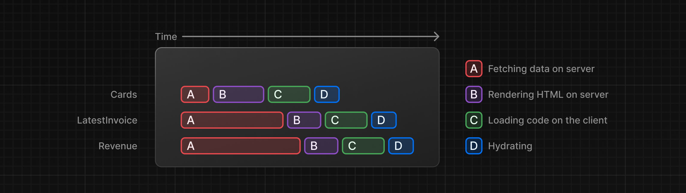

# Next.js Tutorial

This is the starter template for the Next.js App Router Course. It contains the starting code for the dashboard application.

For more information, see the [course curriculum](https://nextjs.org/learn) on the Next.js Website.

## Styling

**Tailwind** and **CSS modules** are the two most common ways of styling Next.js applications. Whether you use one or the other is a matter of preference - **you can even use both in the same application!**

Consider also **[styled-components](https://github.com/vercel/next.js/tree/canary/examples/with-styled-components)**

### Using the `clsx` library to toggle class names

**[clsx](https://github.com/lukeed/clsx)** is tiny utility for constructing className strings conditionally.

There may be cases where you may need to conditionally style an element based on state or some other condition.

```tsx
import clsx from 'clsx';

export default function InvoiceStatus({ status }: { status: string }) {
  return (
    <span
      className={clsx(
        'inline-flex items-center rounded-full px-2 py-1 text-sm',
        {
          'bg-gray-100 text-gray-500': status === 'pending',
          'bg-green-500 text-white': status === 'paid',
        },
      )}
    >
    // ...
)}
```

## Font optimization

**Why optimize fonts?**  
Fonts play a significant role in the design of a website, but using custom fonts in your project can affect performance if the font files need to be fetched and loaded.

**[Cumulative Layout Shift](https://web.dev/articles/cls)** is a metric used by Google to evaluate the performance and user experience of a website. With fonts, layout shift happens when the browser initially renders text in a fallback or system font and then swaps it out for a custom font once it has loaded. This swap can cause the text size, spacing, or layout to change, shifting elements around it.

Next.js automatically optimizes fonts in the application when you use the `next/font` module. **It downloads font files at build time and hosts them with your other static assets.** This means when a user visits your application, there are no additional network requests for fonts which would impact performance.

**Learn more:**  
**[Adding multiple fonts](https://nextjs.org/docs/app/building-your-application/optimizing/fonts#local-fonts)**  
**[Font module API](https://nextjs.org/docs/app/api-reference/components/font#font-function-arguments)**

> **Good to know:**  
> We recommend using **[variable fonts](https://fonts.google.com/variablefonts)** for the best performance and flexibility.

## The `<Image>` component

The `<Image>` Component is an extension of the HTML `` tag, and comes with automatic image optimization, such as:

- **Preventing layout shift** automatically when images are loading.
- **Resizing images** to avoid shipping large images to devices with a smaller viewport.
- **Lazy loading images** by default (images load as they enter the viewport).
- **Serving images in modern formats**, like **[WebP](https://developer.mozilla.org/en-US/docs/Web/Media/Formats/Image_types#webp)** and **[AVIF](https://developer.mozilla.org/en-US/docs/Web/Media/Formats/Image_types#avif_image)**, when the browser supports it.

**Learn more:**  
**[`<Image>` component API](https://nextjs.org/docs/pages/api-reference/components/image)**  
**[Image Optimization Docs](https://nextjs.org/docs/app/building-your-application/optimizing/images)**  
**[Improving web performance with images (MDN)](https://developer.mozilla.org/en-US/docs/Learn/Performance/Multimedia)**  
**[Web Fonts (MDN)](https://developer.mozilla.org/en-US/docs/Learn/CSS/Styling_text/Web_fonts)**

## Creating Layouts and Pages

### Pages

Next.js uses **file-system** routing where folders are used to create nested routes. Each folder represents a route segment that maps to a **URL segment**.


You can create separate UIs for each route using `layout.tsx` and `page.tsx` files.

`page.tsx` is a special Next.js file that exports a React component, and it's required for the route to be accessible. In your application, you already have a page file: `/app/page.tsx` - this is the home page associated with the route `/`.

To create a nested route, you can nest folders inside each other and add `page.tsx` files inside them.

By having a special name for page files, Next.js allows you to [colocate](https://nextjs.org/docs/app/building-your-application/routing#colocation) UI components, test files, and other related code with your routes. Only the content inside the page file will be publicly accessible. For example, the `/ui` and `/lib` folders are colocated inside the `/app` folder along with your routes.

### Layouts

In Next.js, you can use a special `layout.tsx` file to create UI that is shared between multiple pages. The `<Layout />` component receives a `children` prop. **This child can either be a page or another layout**.

One benefit of using layouts in Next.js is that on navigation, only the page components update while the layout won't re-render. **This is called [partial rendering](https://nextjs.org/docs/app/building-your-application/routing/linking-and-navigating#3-partial-rendering)**:


The `/app/layout.tsx` file is called a **[root layout](https://nextjs.org/docs/app/building-your-application/routing/pages)** and is required. Any UI you add to the root layout will be shared across all pages in your application. You can use the root layout to modify your `<html>` and `<body>` tags, and add metadata.

Since the new layout you've just created (`/app/dashboard/layout.tsx`) is unique to the dashboard pages, you don't need to add any UI to the root layout above.

## Navigating between pages

**Why optimize navigation?**  
To link between pages, you'd traditionally use the `<a>` HTML element. but using this options in React will launch to the server a new request, cause a full refresh on the client resulting in a sub-optimal user experience far from authentic [SPA](https://developer.mozilla.org/en-US/docs/Glossary/SPA) experience.

### The `<Link>` component

In Next.js, you can use the `<Link />` Component to link between pages in your application. `<Link>` allows you to do **[client-side navigation](https://nextjs.org/docs/app/building-your-application/routing/linking-and-navigating#how-routing-and-navigation-works)** with JavaScript.

To use the `<Link />` component, open `/app/ui/dashboard/nav-links.tsx`, and import the Link component from `next/link`.

As you can see, the Link component is similar to using `<a>` tags, but instead of `<a href="…">`, you use `<Link href="…">`.

**Although parts of your application are rendered on the server, there's no full page refresh, making it feel like a web app. Why is that?**

### Automatic code-splitting and prefetching

To improve the navigation experience, Next.js automatically code **splits your application by route segments**. This is different from a traditional **React [SPA](https://developer.mozilla.org/en-US/docs/Glossary/SPA)**, where the **browser loads all your application code on initial load**.

Splitting code by routes means that pages become isolated. **If a certain page throws an error, the rest of the application will still work**.

Furthermore, in production, **whenever `<Link>` components appear in the browser's viewport, Next.js automatically prefetches the code for the linked route in the background**. By the time the user clicks the link, the code for the destination page will already be loaded in the background, and this is what makes the page transition near-instant!

Learn more about **[how navigation works](https://nextjs.org/docs/app/building-your-application/routing/linking-and-navigating#how-routing-and-navigation-works)** and **[router cache](https://nextjs.org/docs/app/building-your-application/caching#router-cache)**.

> **Good to know**  
> Prefetching is not enabled in development, only in production.

### Showing active links

To show active link you need to get the user's **current path** (current **segment(s) chain**) from the URL. Next.js provides a hook called **[`usePathname()`](https://nextjs.org/docs/app/api-reference/functions/use-pathname)** that you can import from `next/navigation`.

## Setting up database

TODO: [take notes](https://nextjs.org/learn/dashboard-app/setting-up-your-database)

## Fetching data

### API layer

APIs are an intermediary layer between your application code and database. There are a few cases where you might use an API:

- If you're using 3rd party services that provide an API.
- If you're fetching data from the client, you want to have an API layer that runs on the server to avoid exposing your database secrets to the client.

In Next.js, you can create API endpoints using **[Route Handlers](https://nextjs.org/docs/app/building-your-application/routing/route-handlers)**.

### Database queries

When you're creating a full-stack application, you'll also need to write logic to interact with your database. For **[relational databases](https://aws.amazon.com/relational-database/)** like **Postgres**, you can do this with **SQL**, or an [ORM](https://vercel.com/docs/storage/vercel-postgres/using-an-orm) like [Prisma](https://www.prisma.io/).

There are a few cases where you have to write database queries:

- When creating your API endpoints, you need to write logic to interact with your database.
- If you are using **React Server Components** (fetching data on the server), you can skip the API layer, and query your database directly without risking exposing your database secrets to the client.

### Using server component to fetch data

By default, Next.js application use **[React Server Components](https://nextjs.org/docs/app/building-your-application/rendering/server-components)**. Fetching data with Server Components is a relatively new approach and there are a few benefits of using them:

- Server Components support promises, providing a simpler solution for asynchronous tasks like data fetching. You can use `async/await` syntax without reaching out for `useEffect`, `useState` or data fetching libraries.
- Server Components execute on the server, so you can keep expensive data fetches and logic on the server and only send the result to the client.
- As mentioned before, since Server Components execute on the server, you can query the database directly without an additional API layer.

### Using SQL

For your dashboard project, you'll write database queries using the [Vercel Postgres SDK](https://vercel.com/docs/storage/vercel-postgres/sdk) and SQL. There are a few reasons why we'll be using SQL:

- **SQL** is the industry standard for querying relational databases (e.g. **ORMs** generate **SQL** under the hood).
- Having a basic understanding of **SQL** can help you understand the fundamentals of relational databases, allowing you to apply your knowledge to other tools.
- **SQL** is versatile, allowing you to fetch and manipulate specific data.
- The Vercel Postgres SDK provides protection against **SQL** injections.

You can call **`sql`** inside any Server Component. But to allow you to navigate the components more easily, we've kept all the data queries in the `data.ts` file, and you can import them into the components.

### Practical data fetching

Taking as reference the way data fetching in implemented in `dashboard/page` there are two things you must be aware of:

1. The data requests are unintentionally blocking each other, creating a **request waterfall**.
2. By default, Next.js **prerenders** routes to improve performance, this is called **Static Rendering**. So if your data changes, it won't be reflected on your dashboard.

### Requests waterfall

A **_waterfall_** refers to a sequence of network requests that depend on the completion of the previous ones. In the case of data fetching, each request can only begin once the previous one has returned data.

That is exactly what happen in `dashboard/page`.


One way to solve this problem is to use **parallel data fetching**.

### Parallel data fetching

A common way to avoid waterfalls is to initiate all data requests at the same time - **in parallel** - using JavaScript `Promise` class:

| Static method                         | Description                                                                                                                                                                                                                                                                                                         |
| ------------------------------------- | ------------------------------------------------------------------------------------------------------------------------------------------------------------------------------------------------------------------------------------------------------------------------------------------------------------------- |
| `Promise.all(param:Promise[])`        | Accepts an array of Promise objects and executes the asynchronous requests for each promise. If all promises are fulfilled, **returns a Promise object that resolves to an array of the values that each promise resolves to. If any promise is rejected, this method returns the rejected promise and no others**. |
| `Promise.allSettled(param:Promise[])` | Accepts an array of Promise objects and executes the asynchronous requests for each promise. **Returns a Promise object that resolves to an array of objects for all promises. Within this array, each object has a status property that indicates whether it was fulfilled or rejected.**                          |

**Example:**

```tsx
const invoiceCountPromise = sql`SELECT COUNT(*) FROM invoices`;
const customerCountPromise = sql`SELECT COUNT(*) FROM customers`;
const invoiceStatusPromise = sql`SELECT
         SUM(CASE WHEN status = 'paid' THEN amount ELSE 0 END) AS "paid",
         SUM(CASE WHEN status = 'pending' THEN amount ELSE 0 END) AS "pending"
         FROM invoices`;

const data = await Promise.all([
  invoiceCountPromise,
  customerCountPromise,
  invoiceStatusPromise,
]);
```

By using this pattern, as in `data.ts`, you can:

- Start executing all data fetches at the same time, which can lead to performance gains.
- Use a native JavaScript pattern that can be applied to any library or framework.

**Cons:**  
However, there is one disadvantage of relying only on this JavaScript pattern: **what happens if one data request is slower than all the others?**

## Static and dynamic rendering

### Static rendering

Whit static rendering, data fetching and rendering happens on the server at build time (when you deploy) or during [revalidation](https://nextjs.org/docs/app/building-your-application/data-fetching/fetching-caching-and-revalidating#revalidating-data)(the process of purging the data-catch and re-fetching the latest data).

The result can then be distributed and cached in a [Content Delivery Network](https://nextjs.org/docs/app/building-your-application/rendering/server-components#static-rendering-default).


Whenever a user visits your application, the cached result is served.

**Benefits:**

- **Faster Websites** - Prerendered content can be cached and globally distributed. This ensures that users around the world can access your website's content more quickly and reliably.
- **Reduced Server Load** - Because the content is cached, your server does not have to dynamically generate content for each user request.
- **SEO** - Prerendered content is easier for search engine crawlers to index, as the content is already available when the page loads. This can lead to improved search engine rankings.

**When to use it?**  
Static rendering is useful for **UI with no data or data that is shared across users, such as a static blog post or a product page**. It might not be a good fit for a dashboard that has personalized data that is regularly updated.

### Dynamic rendering

With dynamic rendering, content is rendered on the server for each user at request time (when the user visits the page). There are a couple of benefits of dynamic rendering:

**Benefits**

- **Real-Time Data** - Dynamic rendering allows your application to display real-time or frequently updated data. This is ideal for applications where data changes often.
- **User-Specific Content** - It's easier to serve personalized content, such as dashboards or user profiles, and update the data based on user interaction.
- **Request Time Information** - Dynamic rendering allows you to access information that can only be known at request time, such as cookies or the URL search parameters.

**How?**  
By default, `@vercel/postgres` doesn't set its own caching semantics. This allows the framework to set its own static and dynamic behavior.  
You can use a Next.js API called `unstable_noStore` from `next/cache` inside your Server Components or data fetching functions to opt out of static Rendering  
**Good to known**:  
`unstable_noStore` is an experimental API and may change in the future. If you prefer to use a stable API in your own projects, you can also use the **Segment Config Option:** [`export const dynamic = "force-dynamic"`](https://nextjs.org/docs/app/api-reference/file-conventions/route-segment-config)

**Cons:**  
With dynamic rendering, **your application is only as fast as your slowest data fetch.**

## Streaming

Streaming is a data transfer technique that allows you to break down a route into smaller "chunks" and progressively stream them from the server to the client as they become ready.



By streaming, you can prevent slow data requests from blocking your whole page. This allows the user to see and interact with parts of the page without waiting for all the data to load before any UI can be shown to the user.



**How?**  
Streaming works well with React's component model, as each component can be considered a **_chunk_**.  
There are two ways you implement streaming in Next.js:

1. At the page level, with the `loading.tsx` file.
2. or specific components, with `<Suspense>`.

### Streaming a whole page with `loading.tsx`

**How?**  
In the route to stream just create a new file called `loading` as a sibling of the `page` file:

**Pro:**

1. `loading.tsx` is a special Next.js file built on top of `Suspense,` it allows you to create fallback UI to show as a replacement while page content loads.
2. Since `<SideNav>` is static, it's shown immediately. The user can interact with `<SideNav>` while the dynamic content is loading.
3. The user doesn't have to wait for the page to finish loading before navigating away (this is called **interruptable navigation**).

### Adding loading skeleton

A loading skeleton is a simplified version of the UI. Many websites use them as a placeholder (or fallback) to indicate to users that the content is loading. Any UI you embed into loading.tsx will be embedded as part of the static file, and sent first. Then, the rest of the dynamic content will be streamed from the server to the client.

### Fixing the loading skeleton bug with route groups

Since the previously implemented `loading` file is a level higher in the URL path heirarchy than `/customers/page` and `invoices/page`, the loadig skeleton would apply to both route when navigating to `/dashboard/customers` and `/dashboard/invoices` which result in a bad UX we've got to fix using [route groups](https://nextjs.org/docs/app/building-your-application/routing/route-groups). This way, `loading` file UI will only apply to `/dashboard` URL and to no other sub-URL.

**How:**  
Route groups allow you to organize files into logical groups without affecting the URL path structure. When you create a new folder using parentheses `()`, the name won't be included in the URL path. So `/dashboard/(overview)/page.tsx` becomes `/dashboard`.  
Here, you're using a route group to ensure `loading.tsx` only applies to your dashboard overview page. However, you can also use route groups to separate your application into sections (e.g. `(marketing)` routes and `(shop)` routes) or by teams for larger applications...

## Streaming a component

**React `Suspense` API** allows you to defer rendering parts of your application until some condition is met (e.g. data is loaded). You can wrap your dynamic components in Suspense. Then, pass it a fallback component to show while the dynamic component loads.

> NOTE: The `RevenueChart` component is representational only. For data visualization UI, check out:
> <https://www.tremor.so/> > <https://www.chartjs.org/> > <https://airbnb.io/visx/>

### Deciding where to place your Suspense boundaries

Where you place your Suspense boundaries will depend on a few things:

1. How you want the user to experience the page as it streams.
2. What content you want to prioritize.
3. If the components rely on data fetching.

Take a look at your dashboard page, is there anything you would've done differently?

Don't worry. There isn't a right answer.

- You could stream the whole page like we did with loading.tsx... but that may lead to a longer loading time if one of the components has a slow data fetch.
- You could stream every component individually... but that may lead to UI popping into the screen as it becomes ready.
- You could also create a staggered effect by streaming page sections. But you'll need to create wrapper components.

Where you place your suspense boundaries will vary depending on your application. In general, it's good practice to move your data fetches down to the components that need it, and then wrap those components in Suspense. But there is nothing wrong with streaming the sections or the whole page if that's what your application needs.

Don't be afraid to experiment with Suspense and see what works best, it's a powerful API that can help you create more delightful user experiences.

## Data optimization summary

To recap, you've done a few things to optimize data fetching in your application, you've:

1. Created a database in the same region as your application code to reduce latency between your server and database.
2. Fetched data on the server with React Server Components. This allows you to keep expensive data fetches and logic on the server, reduces the client-side JavaScript bundle, and prevents your database secrets from being exposed to the client.
3. Used SQL to only fetch the data you needed, reducing the amount of data transferred for each request and the amount of JavaScript needed to transform the data in-memory.
4. Parallelize data fetching with JavaScript - where it made sense to do so.
5. Implemented Streaming to prevent slow data requests from blocking your whole page, and to allow the user to start interacting with the UI without waiting for everything to load.
6. Move data fetching down to the components that need it, thus isolating which parts of your routes should be dynamic in preparation for Partial Prerendering.

## Adding search with URL search params

Instead of using **client side state** to implement search here are the benefits of doing it with **URL params**:

- **Bookmarkable and Shareable URLs**: Since the search parameters are in the URL, users can bookmark the current state of the application, including their search queries and filters, for future reference or sharing.
- **Server-Side Rendering and Initial Load**: URL parameters can be directly consumed on the server to render the initial state, making it easier to handle server rendering.
- **Analytics and Tracking**: Having search queries and filters directly in the URL makes it easier to track user behavior without requiring additional client-side logic.

### How?

1. **Capture user's input and update URL**  
   In the `Search` component add an event handler to the `onChange` event listener of the `input` element. Doing so you can retrieve the user's input value and store it in the **current URL** instead of using `useState`. To do it, create a new URL search params based on the current one with `useSearchParams` (it allows you to access the parameters of the current URL. For example, the search params for this URL `/dashboard/invoices?page=1&query=pending` would look like this: `{page: '1', query: 'pending'}`.); and store those values in the current ULR by updating the **browser history stack** with `usePathname` and `useRouter.replace()`.
2. **Keep URL in sync with the input field**  
   To ensure the input field is in sync with the URL and will be populated when sharing, you can pass a `defaultValue` to `input` by reading from searchParams.  
   **Good to know:**  
   `defaultValue` vs. `value` / **Uncontrolled** vs. **Controlled**  
   If you're using state to manage the value of an input, you'd use the `value` attribute to make it a controlled component. This means React would manage the input's state.  
   However, since you're not using `state`, you can use `defaultValue`(a React prop acting as the HTML input value attribute when used as initial default value). This means the native `input` will manage its own state. This is okay since you're saving the search query to the URL instead of `state`.
3. **Retrieve data from the URL on the server and launch request**  
   Use the [`searchParams`](https://nextjs.org/docs/app/api-reference/file-conventions/page), a built-in prop of `Page` server components, which is an oject similar to the returned value of `useSearchParams`.

### When to use the `useSearchParams()` hook vs. the `searchParams` prop?

You might have noticed you used two different ways to extract search params. Whether you use one or the other **depends on whether you're working on the client or the server**.

- `<Search>` is a Client Component, so you used the `useSearchParams()` hook to access the params from the client.
- `<Table>` is a Server Component that fetches its own data, so you can pass the `searchParams` prop from the `page` to the component.

**General rule**:  
If you want to read the params from the client, use the `useSearchParams()` hook as this avoids having to go back to the server.

### Best practices: Debouncing

Quering your database on every key stroke is particularly damaging for resources in case your application skale up. That is where **debouncing** comes into play.

**Debouncing:**  
It is a programming practice that limits the rate at which a function can fire.

**How:**

1. When an event that should be debounced occurs, a timer starts.
2. If the event occurs again before the timer expires, the timer is reset.
3. If the timer reaches the end of its countdown, the debounced function is executed.

You can implement debouncing in a few ways, including manually creating your own debounce function. To keep things simple, we'll use a library called **[use-debounce](https://www.npmjs.com/package/use-debounce)**

## Pagination

After introducing the **search** feature, you'll notice the table displays only 6 invoices at a time. This is because the `fetchFilteredInvoices()` function in `data.ts` returns a maximum of 6 invoices per page.

Adding **pagination** allows users to navigate through the different pages to view all the invoices. Let's see how you can implement pagination using URL params, just like you did with search.

**How?**

- To satisfy `Pagination` **functional logic requirement** two critical pieces of information are needed: (1) the current pagination page number (or `currentPage`); (2) a URL generated on the fly and updated with the contextual pagination page number.
- To satisfy `Pagination` **design requirement** (3) one piece of information is needed: **an array used to design the pagination central console** differently according to the **query result total pages number**(or `totalPages`) and the **current page**.

1. importing `useSearchParams` you can define `currentPage`.
2. associating `usePathname` with the preceding import, you define a util function to generate on the fly URL partial string updated with the contextual page number query.
3. the `generatePagination` util function requires `totalPages` only known after the response from the database. So, since `Pagination` is a client component, `totalPages` is fetched from the **parent** `page` component (which is a server component) and received as `props`.
4. **Lastly:** in the `Search` component **reset to 1** page query for each new query to work.

## Data mutation

**What are Server Actions?**  
**React Server Actions** allow you to run asynchronous code directly on the server. They eliminate the need to create API endpoints to mutate your data. Instead, you write asynchronous functions that execute on the server and can be invoked from your **Client** or **Server Components**.  
Security is a top priority for web applications, as they can be vulnerable to various threats. This is where **Server Actions** come in. They offer an effective security solution, protecting against different types of attacks, securing your data, and ensuring authorized access. Server Actions achieve this through techniques like **POST requests**, **encrypted closures**, **strict input checks**, **error message hashing**, and **host restrictions**, all working together to significantly enhance your app's safety.

### Creating an invoices

1. **Create a form on a new route**
   To start, inside the `/invoices` folder, add a new route segment called `/create` with a `page.tsx` file.

2. **Create a server action**
   By adding the `"use server"`, you mark all the exported functions within the file as **server functions**. These server functions can then be imported into **Client** and **Server components**, making them extremely versatile.  
   You can also write **Server Actions** directly inside **Server Components** by adding `"use server"` inside the action. But for this course, we'll keep them all organized in a separate file.  
   **Good to know**: In HTML, you'd pass a URL to the action attribute. This URL would be the destination where your form data should be submitted (usually an API endpoint).
   However, in React, the `action` attribute is considered a special prop - meaning React builds on top of it to allow actions to be invoked.
   Behind the scenes, Server Actions create a `POST` API endpoint. This is why you don't need to create API endpoints manually when using Server Actions.

3. **Extract the data from `formData`**  
    The `action` callback function recieve by default a `formData` object with a [couple of handy methods](https://developer.mozilla.org/en-US/docs/Web/API/FormData/append) to extract data.  
   **Tip**: If you're working with forms that have many fields, you may want to consider using the [`entries()`](https://developer.mozilla.org/en-US/docs/Web/API/FormData/entries) method with JavaScript's [`Object.fromEntries()`](https://developer.mozilla.org/en-US/docs/Web/JavaScript/Reference/Global_Objects/Object/fromEntries). For example: `const rawFormData = Object.fromEntries(formData.entries())`

TODO: [take notes](https://nextjs.org/learn/dashboard-app/mutating-data)

## Handling errors

Note how `redirect` is being called outside of the `try/catch` block. This is because `redirect` works **by throwing an error**, which would be caught by the catch block. To avoid this, you can call `redirect` after `try/catch.` `redirect` would only be reachable if `try` is successful.

### Handling all errors with `error` file

If an error occur within the `action` before the `try/catch` block, it is displayed in the localhost during development but would break the whole application in production.  
To enhance user eperience the [error file](https://nextjs.org/docs/app/api-reference/file-conventions/error) can be used **to define a UI boundary for a route segment**. It serves as a **catch-all** for unexpected errors and allows you to **display a fallback UI** to your users.

**How:**

- `"use client"` - `error.tsx` needs to be a Client Component.
- It accepts two props:
  1. `error`: This object is an instance of JavaScript's native Error object.
  2. `reset`: This is a function to reset the error boundary. When executed, the function will try to re-render the route segment.

### Handling 404 errors with the `notFound` function

Another way you can handle errors gracefully is by using the `notFound` function. While `error.tsx` is useful for catching all errors, `notFound` can be used when you try to fetch a resource that doesn't exist.  
For example if you visit the url `/app/dashboard/invoices/[id]/edit` with a fake `id` the **catch-all** `error` will fire, which is suboptimal when you need to handle **not-found resources** more specificely.

**How:**  
On the very route leaf (with a `page` file) you want to implement granular error handling create a `not-found` file within which you import `{ notFound }` function from `next/navigation`. You can then fire it on any error that fits your usage of **404 error** or **not found resource**.  
**Remember:** `notFound` will take precedence over `error.tsx,` so you can reach out for it **when you want to handle more specific errors!**

## Improving accessibility

### Form validation with React Form status

NOTE: Impementing **[server-side form validation with `useFormState`](https://nextjs.org/learn/dashboard-app/improving-accessibility)**
