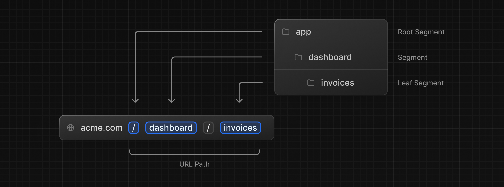
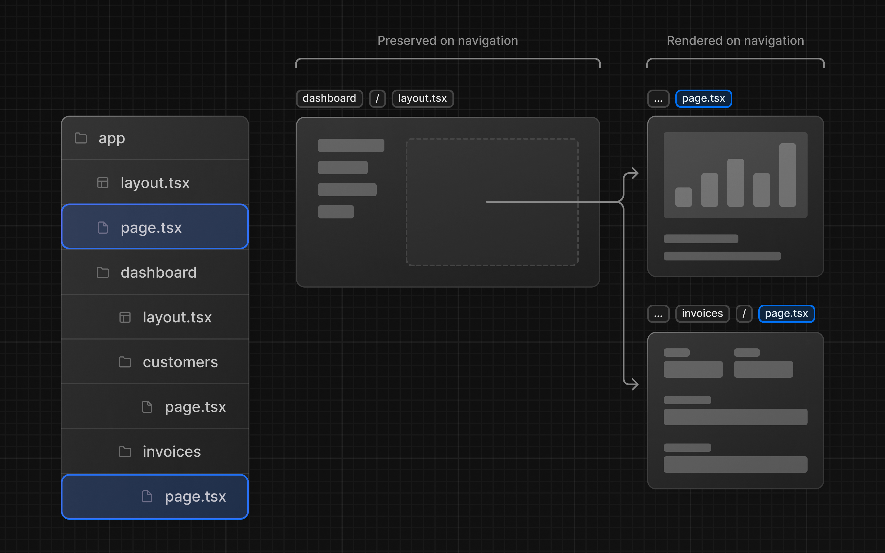

# Next.js Tutorial

This is the starter template for the Next.js App Router Course. It contains the starting code for the dashboard application.

For more information, see the [course curriculum](https://nextjs.org/learn) on the Next.js Website.

## Styling

**Tailwind** and **CSS modules** are the two most common ways of styling Next.js applications. Whether you use one or the other is a matter of preference - **you can even use both in the same application!**

Consider also **[styled-components](https://github.com/vercel/next.js/tree/canary/examples/with-styled-components)**

### Using the `clsx` library to toggle class names

**[clsx](https://github.com/lukeed/clsx)** is tiny utility for constructing className strings conditionally.

There may be cases where you may need to conditionally style an element based on state or some other condition.

```tsx
import clsx from 'clsx';

export default function InvoiceStatus({ status }: { status: string }) {
  return (
    <span
      className={clsx(
        'inline-flex items-center rounded-full px-2 py-1 text-sm',
        {
          'bg-gray-100 text-gray-500': status === 'pending',
          'bg-green-500 text-white': status === 'paid',
        },
      )}
    >
    // ...
)}
```

## Font optimization

**Why optimize fonts?**  
Fonts play a significant role in the design of a website, but using custom fonts in your project can affect performance if the font files need to be fetched and loaded.

**[Cumulative Layout Shift](https://web.dev/articles/cls)** is a metric used by Google to evaluate the performance and user experience of a website. With fonts, layout shift happens when the browser initially renders text in a fallback or system font and then swaps it out for a custom font once it has loaded. This swap can cause the text size, spacing, or layout to change, shifting elements around it.

Next.js automatically optimizes fonts in the application when you use the `next/font` module. **It downloads font files at build time and hosts them with your other static assets.** This means when a user visits your application, there are no additional network requests for fonts which would impact performance.

**Learn more:**  
**[Adding multiple fonts](https://nextjs.org/docs/app/building-your-application/optimizing/fonts#local-fonts)**  
**[Font module API](https://nextjs.org/docs/app/api-reference/components/font#font-function-arguments)**

> **Good to know:**  
> We recommend using **[variable fonts](https://fonts.google.com/variablefonts)** for the best performance and flexibility.

## The `<Image>` component

The `<Image>` Component is an extension of the HTML `` tag, and comes with automatic image optimization, such as:

- **Preventing layout shift** automatically when images are loading.
- **Resizing images** to avoid shipping large images to devices with a smaller viewport.
- **Lazy loading images** by default (images load as they enter the viewport).
- **Serving images in modern formats**, like **[WebP](https://developer.mozilla.org/en-US/docs/Web/Media/Formats/Image_types#webp)** and **[AVIF](https://developer.mozilla.org/en-US/docs/Web/Media/Formats/Image_types#avif_image)**, when the browser supports it.

**Learn more:**  
**[`<Image>` component API](https://nextjs.org/docs/pages/api-reference/components/image)**  
**[Image Optimization Docs](https://nextjs.org/docs/app/building-your-application/optimizing/images)**  
**[Improving web performance with images (MDN)](https://developer.mozilla.org/en-US/docs/Learn/Performance/Multimedia)**  
**[Web Fonts (MDN)](https://developer.mozilla.org/en-US/docs/Learn/CSS/Styling_text/Web_fonts)**

## Creating Layouts and Pages

### Pages

Next.js uses **file-system** routing where folders are used to create nested routes. Each folder represents a route segment that maps to a **URL segment**.



You can create separate UIs for each route using `layout.tsx` and `page.tsx` files.

`page.tsx` is a special Next.js file that exports a React component, and it's required for the route to be accessible. In your application, you already have a page file: `/app/page.tsx` - this is the home page associated with the route `/`.

To create a nested route, you can nest folders inside each other and add `page.tsx` files inside them.

By having a special name for page files, Next.js allows you to [colocate](https://nextjs.org/docs/app/building-your-application/routing#colocation) UI components, test files, and other related code with your routes. Only the content inside the page file will be publicly accessible. For example, the `/ui` and `/lib` folders are colocated inside the `/app` folder along with your routes.

### Layouts

In Next.js, you can use a special `layout.tsx` file to create UI that is shared between multiple pages. The `<Layout />` component receives a `children` prop. **This child can either be a page or another layout**. 

One benefit of using layouts in Next.js is that on navigation, only the page components update while the layout won't re-render. **This is called [partial rendering](https://nextjs.org/docs/app/building-your-application/routing/linking-and-navigating#3-partial-rendering)**:



The `/app/layout.tsx` file is called a **[root layout](https://nextjs.org/docs/app/building-your-application/routing/pages)** and is required. Any UI you add to the root layout will be shared across all pages in your application. You can use the root layout to modify your `<html>` and `<body>` tags, and add metadata.

Since the new layout you've just created (`/app/dashboard/layout.tsx`) is unique to the dashboard pages, you don't need to add any UI to the root layout above.
