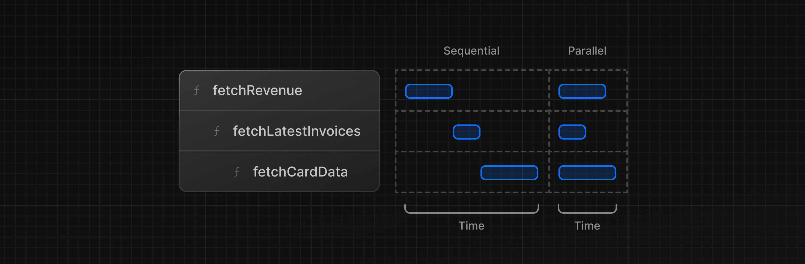
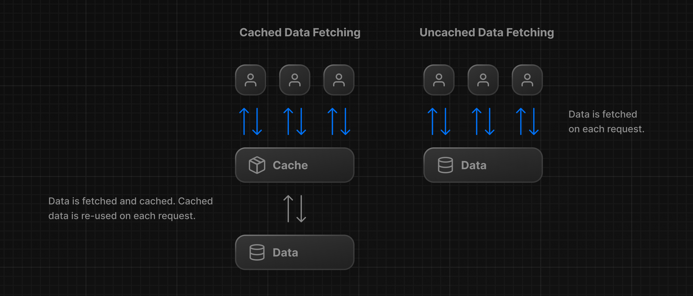

# Next.js Tutorial

This is the starter template for the Next.js App Router Course. It contains the starting code for the dashboard application.

For more information, see the [course curriculum](https://nextjs.org/learn) on the Next.js Website.

## Styling

**Tailwind** and **CSS modules** are the two most common ways of styling Next.js applications. Whether you use one or the other is a matter of preference - **you can even use both in the same application!**

Consider also **[styled-components](https://github.com/vercel/next.js/tree/canary/examples/with-styled-components)**

### Using the `clsx` library to toggle class names

**[clsx](https://github.com/lukeed/clsx)** is tiny utility for constructing className strings conditionally.

There may be cases where you may need to conditionally style an element based on state or some other condition.

```tsx
import clsx from 'clsx';

export default function InvoiceStatus({ status }: { status: string }) {
  return (
    <span
      className={clsx(
        'inline-flex items-center rounded-full px-2 py-1 text-sm',
        {
          'bg-gray-100 text-gray-500': status === 'pending',
          'bg-green-500 text-white': status === 'paid',
        },
      )}
    >
    // ...
)}
```

## Font optimization

**Why optimize fonts?**  
Fonts play a significant role in the design of a website, but using custom fonts in your project can affect performance if the font files need to be fetched and loaded.

**[Cumulative Layout Shift](https://web.dev/articles/cls)** is a metric used by Google to evaluate the performance and user experience of a website. With fonts, layout shift happens when the browser initially renders text in a fallback or system font and then swaps it out for a custom font once it has loaded. This swap can cause the text size, spacing, or layout to change, shifting elements around it.

Next.js automatically optimizes fonts in the application when you use the `next/font` module. **It downloads font files at build time and hosts them with your other static assets.** This means when a user visits your application, there are no additional network requests for fonts which would impact performance.

**Learn more:**  
**[Adding multiple fonts](https://nextjs.org/docs/app/building-your-application/optimizing/fonts#local-fonts)**  
**[Font module API](https://nextjs.org/docs/app/api-reference/components/font#font-function-arguments)**

> **Good to know:**  
> We recommend using **[variable fonts](https://fonts.google.com/variablefonts)** for the best performance and flexibility.

## The `<Image>` component

The `<Image>` Component is an extension of the HTML `` tag, and comes with automatic image optimization, such as:

- **Preventing layout shift** automatically when images are loading.
- **Resizing images** to avoid shipping large images to devices with a smaller viewport.
- **Lazy loading images** by default (images load as they enter the viewport).
- **Serving images in modern formats**, like **[WebP](https://developer.mozilla.org/en-US/docs/Web/Media/Formats/Image_types#webp)** and **[AVIF](https://developer.mozilla.org/en-US/docs/Web/Media/Formats/Image_types#avif_image)**, when the browser supports it.

**Learn more:**  
**[`<Image>` component API](https://nextjs.org/docs/pages/api-reference/components/image)**  
**[Image Optimization Docs](https://nextjs.org/docs/app/building-your-application/optimizing/images)**  
**[Improving web performance with images (MDN)](https://developer.mozilla.org/en-US/docs/Learn/Performance/Multimedia)**  
**[Web Fonts (MDN)](https://developer.mozilla.org/en-US/docs/Learn/CSS/Styling_text/Web_fonts)**

## Creating Layouts and Pages

### Pages

Next.js uses **file-system** routing where folders are used to create nested routes. Each folder represents a route segment that maps to a **URL segment**.


You can create separate UIs for each route using `layout.tsx` and `page.tsx` files.

`page.tsx` is a special Next.js file that exports a React component, and it's required for the route to be accessible. In your application, you already have a page file: `/app/page.tsx` - this is the home page associated with the route `/`.

To create a nested route, you can nest folders inside each other and add `page.tsx` files inside them.

By having a special name for page files, Next.js allows you to [colocate](https://nextjs.org/docs/app/building-your-application/routing#colocation) UI components, test files, and other related code with your routes. Only the content inside the page file will be publicly accessible. For example, the `/ui` and `/lib` folders are colocated inside the `/app` folder along with your routes.

### Layouts

In Next.js, you can use a special `layout.tsx` file to create UI that is shared between multiple pages. The `<Layout />` component receives a `children` prop. **This child can either be a page or another layout**.

One benefit of using layouts in Next.js is that on navigation, only the page components update while the layout won't re-render. **This is called [partial rendering](https://nextjs.org/docs/app/building-your-application/routing/linking-and-navigating#3-partial-rendering)**:


The `/app/layout.tsx` file is called a **[root layout](https://nextjs.org/docs/app/building-your-application/routing/pages)** and is required. Any UI you add to the root layout will be shared across all pages in your application. You can use the root layout to modify your `<html>` and `<body>` tags, and add metadata.

Since the new layout you've just created (`/app/dashboard/layout.tsx`) is unique to the dashboard pages, you don't need to add any UI to the root layout above.

## Navigating between pages

**Why optimize navigation?**  
To link between pages, you'd traditionally use the `<a>` HTML element. but using this options in React will launch to the server a new request, cause a full refresh on the client resulting in a sub-optimal user experience far from authentic [SPA](https://developer.mozilla.org/en-US/docs/Glossary/SPA) experience.

### The `<Link>` component

In Next.js, you can use the `<Link />` Component to link between pages in your application. `<Link>` allows you to do **[client-side navigation](https://nextjs.org/docs/app/building-your-application/routing/linking-and-navigating#how-routing-and-navigation-works)** with JavaScript.

To use the `<Link />` component, open `/app/ui/dashboard/nav-links.tsx`, and import the Link component from `next/link`.

As you can see, the Link component is similar to using `<a>` tags, but instead of `<a href="…">`, you use `<Link href="…">`.

**Although parts of your application are rendered on the server, there's no full page refresh, making it feel like a web app. Why is that?**

### Automatic code-splitting and prefetching

To improve the navigation experience, Next.js automatically code **splits your application by route segments**. This is different from a traditional **React [SPA](https://developer.mozilla.org/en-US/docs/Glossary/SPA)**, where the **browser loads all your application code on initial load**.

Splitting code by routes means that pages become isolated. **If a certain page throws an error, the rest of the application will still work**.

Furthermore, in production, **whenever `<Link>` components appear in the browser's viewport, Next.js automatically prefetches the code for the linked route in the background**. By the time the user clicks the link, the code for the destination page will already be loaded in the background, and this is what makes the page transition near-instant!

Learn more about **[how navigation works](https://nextjs.org/docs/app/building-your-application/routing/linking-and-navigating#how-routing-and-navigation-works)** and **[router cache](https://nextjs.org/docs/app/building-your-application/caching#router-cache)**.

> **Good to know**  
> Prefetching is not enabled in development, only in production.

### Showing active links

To show active link you need to get the user's **current path** (current **segment(s) chain**) from the URL. Next.js provides a hook called **[`usePathname()`](https://nextjs.org/docs/app/api-reference/functions/use-pathname)** that you can import from `next/navigation`.

## Setting up database

TODO: [take notes](https://nextjs.org/learn/dashboard-app/setting-up-your-database)

## Fetching data

### API layer

APIs are an intermediary layer between your application code and database. There are a few cases where you might use an API:

- If you're using 3rd party services that provide an API.
- If you're fetching data from the client, you want to have an API layer that runs on the server to avoid exposing your database secrets to the client.

In Next.js, you can create API endpoints using **[Route Handlers](https://nextjs.org/docs/app/building-your-application/routing/route-handlers)**.

### Database queries

When you're creating a full-stack application, you'll also need to write logic to interact with your database. For **[relational databases](https://aws.amazon.com/relational-database/)** like **Postgres**, you can do this with **SQL**, or an [ORM](https://vercel.com/docs/storage/vercel-postgres/using-an-orm) like [Prisma](https://www.prisma.io/).

There are a few cases where you have to write database queries:

- When creating your API endpoints, you need to write logic to interact with your database.
- If you are using **React Server Components** (fetching data on the server), you can skip the API layer, and query your database directly without risking exposing your database secrets to the client.

### Using server component to fetch data

By default, Next.js application use **[React Server Components](https://nextjs.org/docs/app/building-your-application/rendering/server-components)**. Fetching data with Server Components is a relatively new approach and there are a few benefits of using them:

- Server Components support promises, providing a simpler solution for asynchronous tasks like data fetching. You can use `async/await` syntax without reaching out for `useEffect`, `useState` or data fetching libraries.
- Server Components execute on the server, so you can keep expensive data fetches and logic on the server and only send the result to the client.
- As mentioned before, since Server Components execute on the server, you can query the database directly without an additional API layer.

### Using SQL

For your dashboard project, you'll write database queries using the [Vercel Postgres SDK](https://vercel.com/docs/storage/vercel-postgres/sdk) and SQL. There are a few reasons why we'll be using SQL:

- **SQL** is the industry standard for querying relational databases (e.g. **ORMs** generate **SQL** under the hood).
- Having a basic understanding of **SQL** can help you understand the fundamentals of relational databases, allowing you to apply your knowledge to other tools.
- **SQL** is versatile, allowing you to fetch and manipulate specific data.
- The Vercel Postgres SDK provides protection against **SQL** injections.

You can call **`sql`** inside any Server Component. But to allow you to navigate the components more easily, we've kept all the data queries in the `data.ts` file, and you can import them into the components.

### Practical data fetching

Taking as reference the way data fetching in implemented in `dashboard/page` there are two things you must be aware of:

1. The data requests are unintentionally blocking each other, creating a **request waterfall**.
2. By default, Next.js **prerenders** routes to improve performance, this is called **Static Rendering**. So if your data changes, it won't be reflected on your dashboard.

### Requests waterfall

A **_waterfall_** refers to a sequence of network requests that depend on the completion of the previous ones. In the case of data fetching, each request can only begin once the previous one has returned data.

That is exactly what happen in `dashboard/page`.



One way to solve this problem is to use **parallel data fetching**.

### Parallel data fetching

A common way to avoid waterfalls is to initiate all data requests at the same time - **in parallel** - using JavaScript `Promise` class:

| Static method                         | Description                                                                                                                                                                                                                                                                                                         |
| ------------------------------------- | ------------------------------------------------------------------------------------------------------------------------------------------------------------------------------------------------------------------------------------------------------------------------------------------------------------------- |
| `Promise.all(param:Promise[])`        | Accepts an array of Promise objects and executes the asynchronous requests for each promise. If all promises are fulfilled, **returns a Promise object that resolves to an array of the values that each promise resolves to. If any promise is rejected, this method returns the rejected promise and no others**. |
| `Promise.allSettled(param:Promise[])` | Accepts an array of Promise objects and executes the asynchronous requests for each promise. **Returns a Promise object that resolves to an array of objects for all promises. Within this array, each object has a status property that indicates whether it was fulfilled or rejected.**                          |

**Example:**

```tsx
const invoiceCountPromise = sql`SELECT COUNT(*) FROM invoices`;
const customerCountPromise = sql`SELECT COUNT(*) FROM customers`;
const invoiceStatusPromise = sql`SELECT
         SUM(CASE WHEN status = 'paid' THEN amount ELSE 0 END) AS "paid",
         SUM(CASE WHEN status = 'pending' THEN amount ELSE 0 END) AS "pending"
         FROM invoices`;

const data = await Promise.all([
  invoiceCountPromise,
  customerCountPromise,
  invoiceStatusPromise,
]);
```

By using this pattern, as in `data.ts`, you can:

- Start executing all data fetches at the same time, which can lead to performance gains.
- Use a native JavaScript pattern that can be applied to any library or framework.

**Cons:**  
However, there is one disadvantage of relying only on this JavaScript pattern: **what happens if one data request is slower than all the others?**
## Static and dynamic rendering

### Static rendering

Whit static rendering, data fetching and rendering happens on the server at build time (when you deploy) or during [revalidation](https://nextjs.org/docs/app/building-your-application/data-fetching/fetching-caching-and-revalidating#revalidating-data)(the process of purging the data-catch and re-fetching the latest data).

The result can then be distributed and cached in a [Content Delivery Network](https://nextjs.org/docs/app/building-your-application/rendering/server-components#static-rendering-default).



Whenever a user visits your application, the cached result is served.

**Benefits:**

- **Faster Websites** - Prerendered content can be cached and globally distributed. This ensures that users around the world can access your website's content more quickly and reliably.
- **Reduced Server Load** - Because the content is cached, your server does not have to dynamically generate content for each user request.
- **SEO** - Prerendered content is easier for search engine crawlers to index, as the content is already available when the page loads. This can lead to improved search engine rankings.

**When to use it?**  
Static rendering is useful for **UI with no data or data that is shared across users, such as a static blog post or a product page**. It might not be a good fit for a dashboard that has personalized data that is regularly updated.

### Dynamic rendering

With dynamic rendering, content is rendered on the server for each user at request time (when the user visits the page). There are a couple of benefits of dynamic rendering:

**Benefits**

- **Real-Time Data** - Dynamic rendering allows your application to display real-time or frequently updated data. This is ideal for applications where data changes often.
- **User-Specific Content** - It's easier to serve personalized content, such as dashboards or user profiles, and update the data based on user interaction.
- **Request Time Information** - Dynamic rendering allows you to access information that can only be known at request time, such as cookies or the URL search parameters.

**How?**  
By default, `@vercel/postgres` doesn't set its own caching semantics. This allows the framework to set its own static and dynamic behavior.  
You can use a Next.js API called `unstable_noStore` from `next/cache` inside your Server Components or data fetching functions to opt out of static Rendering  
**Good to known**:  
`unstable_noStore` is an experimental API and may change in the future. If you prefer to use a stable API in your own projects, you can also use the **Segment Config Option:** [`export const dynamic = "force-dynamic"`](https://nextjs.org/docs/app/api-reference/file-conventions/route-segment-config)
